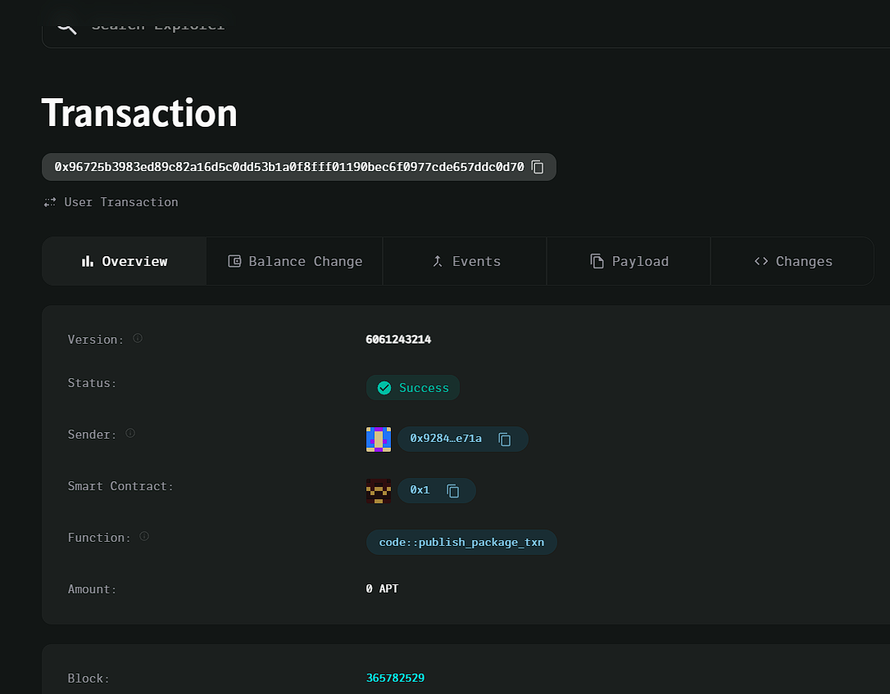

### Deployed smartcontract address: 0x96725b3983ed89c82a16d5c0dd53b1a0f8fff01190bec6f0977cde657ddc0d70

### Screenshot:

# Land Ownership Registry

## Project Title
Land Ownership Registry

## Project Description
The **Land Ownership Registry** is a decentralized system that records land ownership transactions immutably on the blockchain. It allows users to register land and transfer ownership in a secure and transparent manner, ensuring that all transactions are stored in an immutable ledger.

## Vision
To create a transparent, secure, and decentralized registry for land ownership, where individuals can securely register and transfer land, ensuring trust and reducing disputes. This system aims to replace traditional land registry systems with a blockchain-powered alternative that is resistant to tampering and fraud.

## Key Features
- **Decentralized Land Registration**: Users can register land on the blockchain, which is securely tied to their account.
- **Ownership Transfer**: Land ownership can be easily transferred between accounts, ensuring seamless transactions.
- **Immutability**: All ownership transactions are stored immutably on the blockchain, preventing tampering or fraud.
- **Secure Data**: The use of cryptographic principles ensures that the data is securely recorded and verifiable by anyone.

## Future Scope
- **Land Dispute Resolution**: Implement smart contract-based mechanisms to resolve land disputes.
- **Integration with Geographic Information Systems (GIS)**: Link the land registry system to real-world geographic coordinates and mapping systems.
- **Smart Contracts for Leasing**: Introduce smart contracts for leasing or renting land through the platform.
- **Tokenization of Land Assets**: Allow tokenization of land ownership to facilitate fractional ownership and investment.

